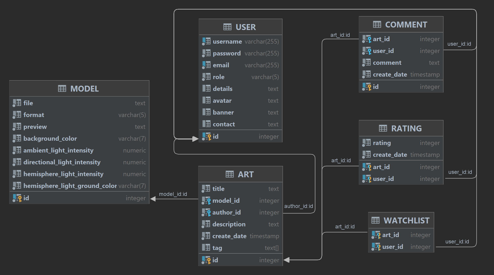

  Decardo API

  Технічне завдання

  Предметна область

3D Арт-галерея - це онлайн-платформа, де автори можуть демонструвати свої 3D роботи, а користувачі можуть переглядати, коментувати та оцінювати їх. Основні сутності предметної області включають роботи (3D моделі), авторів цих робіт, ціну, коментарі користувачів та оцінки. Користувачі можуть бути як звичайними відвідувачами, так і адміністраторами, які мають права на додавання та редагування контенту.

  Опис функціональності

1) Система повинна дозволяти користувачам переглядати колекції 3D арт-робіт.
2) Користувачі повинні мати можливість шукати роботи за різними критеріями, такими як автор, жанр, рік створення і т.д.
3) Користувачі можуть залишати коментарі та оцінки для робіт.
4) Адміністратор повинен мати можливість додавати, видаляти та редагувати роботи та інформацію про авторів.
5) Адміністратор повинен мати можливість модерувати коментарі та оцінки.

  Endpoint

Посилання на swagger [{baseUrl}/swagger-ui/index.html#/](http://localhost:8080/swagger-ui/index.html#/)

  Опис схеми бази даних

  Таблиця "USER"

Таблиця `USER` зберігає інформацію про користувачів.

| Колонка  | Тип          | Обмеження                                                   | Опис                                            |
|----------|--------------|-------------------------------------------------------------|-------------------------------------------------|
| ID       | SERIAL       | PRIMARY KEY                                                 | Унікальний ідентифікатор користувача            |
| USERNAME | VARCHAR(255) | NOT NULL, UNIQUE                                            | Ім'я користувача                                |
| PASSWORD | VARCHAR(255) | NOT NULL                                                    | Пароль користувача                              |
| EMAIL    | VARCHAR(255) | NOT NULL, UNIQUE                                            | Email адреса користувача                        |
| ROLE     | VARCHAR(5)   | NOT NULL, DEFAULT 'USER', CHECK (ROLE IN ('USER', 'ADMIN')) | Роль користувача (може бути 'USER' або 'ADMIN') |
| DETAILS  | TEXT         | NULL                                                        | Додаткова інформація про користувача            |
| AVATAR   | TEXT         | NULL                                                        | URL до аватару користувача                      |
| BANNER   | TEXT         | NULL                                                        | URL до банера користувача                       |
| CONTACT  | TEXT         | NULL                                                        | Контактна інформація користувача                |

  Таблиця "MODEL"

Таблиця `MODEL` зберігає інформацію про 3D моделі.

| Колонка                       | Тип        | Обмеження                                                                | Опис                                                      |
|-------------------------------|------------|--------------------------------------------------------------------------|-----------------------------------------------------------|
| ID                            | SERIAL     | PRIMARY KEY                                                              | Унікальний ідентифікатор моделі                           |
| FILE                          | TEXT       | NOT NULL                                                                 | Шлях до файлу або URL моделі                              |
| FORMAT                        | VARCHAR(5) | NOT NULL, DEFAULT 'obj', CHECK (FORMAT IN ('fbx', 'glb', 'gltf', 'obj')) | Формат файлу моделі                                       |
| PREVIEW                       | TEXT       | NOT NULL                                                                 | URL до прев'ю зображення моделі                           |
| BACKGROUND_COLOR              | VARCHAR(7) | NOT NULL                                                                 | Колір фону в шістнадцятковому форматі                     |
| AMBIENT_LIGHT_INTENSITY       | DECIMAL    | NOT NULL                                                                 | Інтенсивність навколишнього світла                        |
| DIRECTIONAL_LIGHT_INTENSITY   | DECIMAL    | NOT NULL                                                                 | Інтенсивність направленого світла                         |
| HEMISPHERE_LIGHT_INTENSITY    | DECIMAL    | NOT NULL                                                                 | Інтенсивність гемуферного світла                          |
| HEMISPHERE_LIGHT_GROUND_COLOR | VARCHAR(7) | NOT NULL                                                                 | Колір землі гемуферного світла в шістнадцятковому форматі |

  Таблиця "ART"

Таблиця `ART` зберігає інформацію про твори мистецтва.

| Колонка     | Тип        | Обмеження                                                | Опис                                     |
|-------------|------------|----------------------------------------------------------|------------------------------------------|
| ID          | SERIAL     | PRIMARY KEY                                              | Унікальний ідентифікатор твору мистецтва |
| TITLE       | TEXT       | NOT NULL                                                 | Назва твору мистецтва                    |
| MODEL_ID    | INT        | NOT NULL, FOREIGN KEY (MODEL_ID) REFERENCES "MODEL" (ID) | Ідентифікатор асоційованої моделі        |
| AUTHOR_ID   | INT        | NOT NULL, FOREIGN KEY (AUTHOR_ID) REFERENCES "USER" (ID) | Ідентифікатор автора (користувача)       |
| DESCRIPTION | TEXT       | NOT NULL                                                 | Опис твору мистецтва                     |
| CREATE_DATE | TIMESTAMP  | DEFAULT CURRENT_TIMESTAMP, NOT NULL                      | Дата та час створення твору мистецтва    |
| TAG         | TEXT ARRAY | NULL                                                     | Теги, пов'язані з твором мистецтва       |

  Таблиця "WATCHLIST"

Таблиця `WATCHLIST` зберігає інформацію про списки відстеження користувачів.

| Колонка                       | Тип | Обмеження                                              | Опис                                                         |
|-------------------------------|-----|--------------------------------------------------------|--------------------------------------------------------------|
| ART_ID                        | INT | NOT NULL, FOREIGN KEY (ART_ID) REFERENCES "ART" (ID)   | Ідентифікатор твору мистецтва                                |
| USER_ID                       | INT | NOT NULL, FOREIGN KEY (USER_ID) REFERENCES "USER" (ID) | Ідентифікатор користувача                                    |
| PRIMARY KEY (ART_ID, USER_ID) |     |                                                        | Складовий первинний ключ, що складається з ART_ID та USER_ID |

  Таблиця "COMMENT"

Таблиця `COMMENT` зберігає коментарі, зроблені користувачами до творів мистецтва.

| Колонка     | Тип       | Обмеження                                              | Опис                                           |
|-------------|-----------|--------------------------------------------------------|------------------------------------------------|
| ID          | SERIAL    | PRIMARY KEY                                            | Унікальний ідентифікатор коментаря             |
| ART_ID      | INT       | NOT NULL, FOREIGN KEY (ART_ID) REFERENCES "ART" (ID)   | Ідентифікатор пов'язаного твору мистецтва      |
| USER_ID     | INT       | NOT NULL, FOREIGN KEY (USER_ID) REFERENCES "USER" (ID) | Ідентифікатор користувача, що залишив коментар |
| COMMENT     | TEXT      | NOT NULL                                               | Зміст коментаря                                |
| CREATE_DATE | TIMESTAMP | DEFAULT CURRENT_TIMESTAMP, NOT NULL                    | Дата та час створення коментаря                |

  Таблиця "RATING"

Таблиця `RATING` зберігає оцінки, надані користувачами творам мистецтва.

| Колонка                       | Тип       | Обмеження                                              | Опис                                                         |
|-------------------------------|-----------|--------------------------------------------------------|--------------------------------------------------------------|
| ART_ID                        | INT       | NOT NULL, FOREIGN KEY (ART_ID) REFERENCES "ART" (ID)   | Ідентифікатор оцінюваного твору мистецтва                    |
| USER_ID                       | INT       | NOT NULL, FOREIGN KEY (USER_ID) REFERENCES "USER" (ID) | Ідентифікатор користувача, що надав оцінку                   |
| RATING                        | INT       | NOT NULL                                               | Значення оцінки, наданої користувачем                        |
| CREATE_DATE                   | TIMESTAMP | DEFAULT CURRENT_TIMESTAMP, NOT NULL                    | Дата та час надання оцінки                                   |
| PRIMARY KEY (ART_ID, USER_ID) |           |                                                        | Складовий первинний ключ, що складається з ART_ID та USER_ID |

  ER діаграма

  

